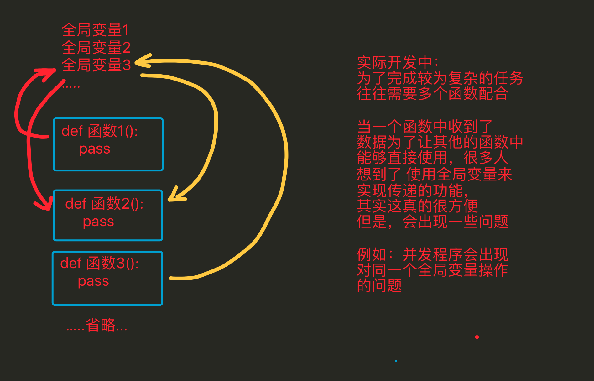
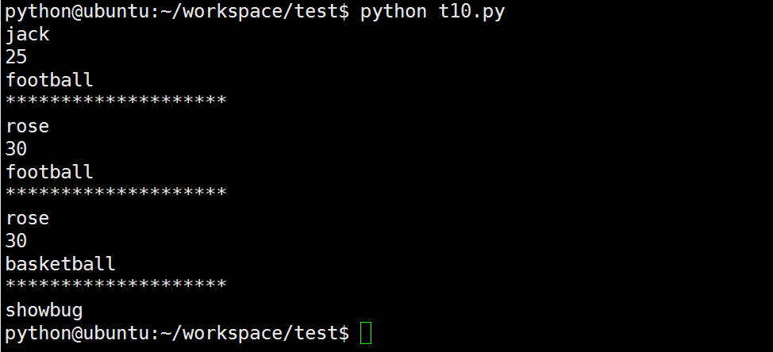
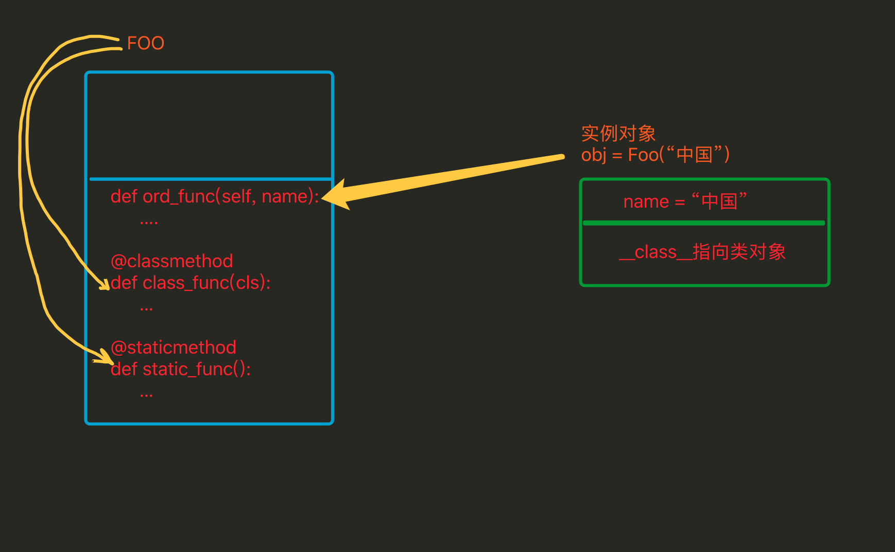

## 再议 封装、继承、多态

封装、继承、多态 是面向对象的3大特性

## 为啥要封装




#### 好处

> 1. 在使用面向过程编程时，当需要对数据处理时，需要考虑用哪个模板中哪个函数来进行操作，但是当用面向对象编程时，因为已经将数据存储到了这个独立的空间中，这个独立的空间（即对象）中通过一个特殊的变量（__class__）能够获取到类（模板），而且这个类中的方法是有一定数量的，与此类无关的将不会出现在本类中，因此需要对数据处理时，可以很快速的定位到需要的方法是谁 这样更方便
> 2. 全局变量是只能有1份的，多很多个函数需要多个备份时，往往需要利用其它的变量来进行储存；而通过封装 会将用来存储数据的这个变量 变为了对象中的一个“全局”变量，只要对象不一样那么这个变量就可以再有1份，所以这样更方便
> 3. 代码划分更清晰

面向过程

```python
全局变量1
全局变量2
全局变量3
...

def 函数1():
    pass


def 函数2():
    pass


def 函数3():
    pass


def 函数4():
    pass


def 函数5():
    pass
```

面向对象

```python
class 类(object):
    属性1
    属性2

    def 方法1(self):
        pass

    def 方法2(self):
        pass

class 类2(object):
    属性3
    def 方法3(self):
        pass

    def 方法4(self):
        pass

    def 方法5(self):
        pass
```

## 为啥要继承


#### 说明

> 1. 能够提升代码的重用率，即开发一个类，可以在多个子功能中直接使用
> 2. 继承能够有效的进行代码的管理，当某个类有问题只要修改这个类就行，而其继承这个类的子类往往不需要就修改

## 怎样理解多态

```python
class MiniOS(object):
    """MiniOS 操作系统类 """
    def __init__(self, name):
        self.name = name
        self.apps = []  # 安装的应用程序名称列表

    def __str__(self):
        return "%s 安装的软件列表为 %s" % (self.name, str(self.apps))

    def install_app(self, app):
        # 判断是否已经安装了软件
        if app.name in self.apps:
            print("已经安装了 %s，无需再次安装" % app.name)
        else:
            app.install()
            self.apps.append(app.name)


class App(object):
    def __init__(self, name, version, desc):
        self.name = name
        self.version = version
        self.desc = desc

    def __str__(self):
        return "%s 的当前版本是 %s - %s" % (self.name, self.version, self.desc)

    def install(self):
        print("将 %s [%s] 的执行程序复制到程序目录..." % (self.name, self.version))


class PyCharm(App):
    pass


class Chrome(App):
    def install(self):
        print("正在解压缩安装程序...")
        super().install()


linux = MiniOS("Linux")
print(linux)

pycharm = PyCharm("PyCharm", "1.0", "python 开发的 IDE 环境")
chrome = Chrome("Chrome", "2.0", "谷歌浏览器")

linux.install_app(pycharm)
linux.install_app(chrome)
linux.install_app(chrome)

print(linux)
```

运行结果

```
Linux 安装的软件列表为 []
将 PyCharm [1.0] 的执行程序复制到程序目录...
正在解压缩安装程序...
将 Chrome [2.0] 的执行程序复制到程序目录...
已经安装了 Chrome，无需再次安装
Linux 安装的软件列表为 ['PyCharm', 'Chrome']
```

## 私有化

- xx: 公有变量
- _x: 单前置下划线,私有化属性或方法，from somemodule import *禁止导入,类对象和子类可以访问
- __xx：双前置下划线,避免与子类中的属性命名冲突，无法在外部直接访问(名字重整所以访问不到)
- __xx__:双前后下划线,用户名字空间的魔法对象或属性。例如:`__init__` , __ 不要自己发明这样的名字
- xx_:单后置下划线,用于避免与Python关键词的冲突

通过name mangling（名字重整(目的就是以防子类意外重写基类的方法或者属性)如：_Class__object）机制就可以访问private了。

```python
#coding=utf-8

class Person(object):
    def __init__(self, name, age, taste):
        self.name = name
        self._age = age 
        self.__taste = taste

    def showperson(self):
        print(self.name)
        print(self._age)
        print(self.__taste)

    def dowork(self):
        self._work()
        self.__away()


    def _work(self):
        print('my _work')

    def __away(self):
        print('my __away')

class Student(Person):
    def construction(self, name, age, taste):
        self.name = name
        self._age = age 
        self.__taste = taste

    def showstudent(self):
        print(self.name)
        print(self._age)
        print(self.__taste)

    @staticmethod
    def testbug():
        _Bug.showbug()

# 模块内可以访问，当from  cur_module import *时，不导入
class _Bug(object):
    @staticmethod
    def showbug():
        print("showbug")

s1 = Student('jack', 25, 'football')
s1.showperson()
print('*'*20)

# 无法访问__taste,导致报错
# s1.showstudent() 
s1.construction('rose', 30, 'basketball')
s1.showperson()
print('*'*20)

s1.showstudent()
print('*'*20)

Student.testbug()
```



#### 总结

- 父类中属性名为`__名字`的，子类不继承，子类不能访问
- 如果在子类中向`__名字`赋值，那么会在子类中定义的一个与父类相同名字的属性
- `_名`的变量、函数、类在使用`from xxx import *`时都不会被导入


## 静态方法和类方法

### 1. 类属性、实例属性

它们在定义和使用中有所区别，而最本质的区别是内存中保存的位置不同，

- 实例属性属于对象
- 类属性属于类

```python
class Province(object):
    # 类属性
    country = '中国'

    def __init__(self, name):
        # 实例属性
        self.name = name


# 创建一个实例对象
obj = Province('山东省')
# 直接访问实例属性
print(obj.name)
# 直接访问类属性
Province.country
```

由上述代码可以看出【实例属性需要通过对象来访问】【类属性通过类访问】，在使用上可以看出实例属性和类属性的归属是不同的。

其在内容的存储方式类似如下图：


由上图看出：

- 类属性在内存中只保存一份
- 实例属性在每个对象中都要保存一份

#### 应用场景：

- 通过类创建实例对象时，如果每个对象需要具有相同名字的属性，那么就使用类属性，用一份既可

### 2. 实例方法、静态方法和类方法

方法包括：实例方法、静态方法和类方法，三种方法在内存中都归属于类，区别在于调用方式不同。

- 实例方法：由对象调用；至少一个self参数；执行实例方法时，自动将调用该方法的对象赋值给self；
- 类方法：由类调用，只能访问类属性，不能访问实例属性； 至少一个cls参数；执行类方法时，自动将调用该方法的类赋值给cls；
- 静态方法：由类调用；无默认参数；

```python
class Foo(object):
    def __init__(self, name):
        self.name = name

    def ord_func(self):
        """ 定义实例方法，至少有一个self参数 """
        # print(self.name)
        print('实例方法')

    @classmethod
    def class_func(cls):
        """ 定义类方法，至少有一个cls参数 """
        print('类方法')

    @staticmethod
    def static_func():
        """ 定义静态方法 ，无默认参数"""
        print('静态方法')


f = Foo("中国")
# 调用实例方法
f.ord_func()

# 调用类方法
Foo.class_func()

# 调用静态方法
Foo.static_func()
```




**通过**@staticmethod 装饰器即可把其装饰的方法变为一个静态方法，什么是静态方法呢？其实不难理解，普通的方法，可以在实例化后直接调用，并且在方法里可以通过self.调用实例变量或类变量，但静态方法是不可以访问实例变量或类变量的，一个不能访问实例变量和类变量的方法，其实相当于跟类本身已经没什么关系了，它与类唯一的关联就是需要通过类名来调用这个方法

```python
`class` `Dog(``object``):` `    ``def` `__init__(``self``,name):``        ``self``.name ``=` `name` `    ``@staticmethod` `#把eat方法变为静态方法``    ``def` `eat(``self``):``        ``print``(``"%s is eating"` `%` `self``.name)`   `d ``=` `Dog(``"ChenRonghua"``)``d.eat()`
```

上面的调用会出以下错误，说是eat需要一个self参数，但调用时却没有传递，没错，当eat变成静态方法后，再通过实例调用时就不会自动把实例本身当作一个参数传给self了。

1. 调用时主动传递实例本身给eat方法，即d.eat(d) 

2. 在eat方法中去掉self参数，但这也意味着，在eat中不能通过self.调用实例中的其它变量了

#### 对比

- 相同点：对于所有的方法而言，均属于类，所以 在内存中也只保存一份
- 不同点：方法调用者不同、调用方法时自动传入的参数不同。


## property属性

### 1. 什么是property属性

一种用起来像是使用的实例属性一样的特殊属性，可以对应于某个方法

```python
# ############### 定义 ###############
class Foo:
    def func(self):
        pass

    # 定义property属性
    @property
    def prop(self):
        pass

# ############### 调用 ###############
foo_obj = Foo()
foo_obj.func()  # 调用实例方法
foo_obj.prop  # 调用property属性
```


##### property属性的定义和调用要注意一下几点：

- 定义时，在实例方法的基础上添加 @property 装饰器；并且仅有一个self参数

- 调用时，无需括号

  ```python
    方法：foo_obj.func()
    property属性：foo_obj.prop
  ```

### 2. 简单的实例

> 对于京东商城中显示电脑主机的列表页面，每次请求不可能把数据库中的所有内容都显示到页面上，而是通过分页的功能局部显示，所以在向数据库中请求数据时就要显示的指定获取从第m条到第n条的所有数据 这个分页的功能包括：
>
> - 根据用户请求的当前页和总数据条数计算出 m 和 n
> - 根据m 和 n 去数据库中请求数据

```python
# ############### 定义 ###############
class Pager:
    def __init__(self, current_page):
        # 用户当前请求的页码（第一页、第二页...）
        self.current_page = current_page
        # 每页默认显示10条数据
        self.per_items = 10 

    @property
    def start(self):
        val = (self.current_page - 1) * self.per_items
        return val

    @property
    def end(self):
        val = self.current_page * self.per_items
        return val

# ############### 调用 ###############
p = Pager(1)
p.start  # 就是起始值，即：m
p.end  # 就是结束值，即：n
```

#### 从上述可见

- Python的property属性的功能是：property属性内部进行一系列的逻辑计算，最终将计算结果返回。

### 3. property属性的有两种方式

- 装饰器 即：在方法上应用装饰器
- 类属性 即：在类中定义值为property对象的类属性

#### 3.1 装饰器方式

在类的实例方法上应用@property装饰器

Python中的类有`经典类`和`新式类`，`新式类`的属性比`经典类`的属性丰富。（ 如果类继object，那么该类是新式类 ）

##### 经典类，具有一种@property装饰器

```python
# ############### 定义 ###############    
class Goods:
    @property
    def price(self):
        return "laowang"
# ############### 调用 ###############
obj = Goods()
result = obj.price  # 自动执行 @property 修饰的 price 方法，并获取方法的返回值
print(result)
```

##### 新式类，具有三种@property装饰器

```python
#coding=utf-8
# ############### 定义 ###############
class Goods:
    """python3中默认继承object类
        以python2、3执行此程序的结果不同，因为只有在python3中才有@xxx.setter  @xxx.deleter
    """
    @property
    def price(self):
        print('@property')

    @price.setter
    def price(self, value):
        print('@price.setter')

    @price.deleter
    def price(self):
        print('@price.deleter')

# ############### 调用 ###############
obj = Goods()
obj.price          # 自动执行 @property 修饰的 price 方法，并获取方法的返回值
obj.price = 123    # 自动执行 @price.setter 修饰的 price 方法，并将  123 赋值给方法的参数
del obj.price      # 自动执行 @price.deleter 修饰的 price 方法
```

##### 注意

- 经典类中的属性只有一种访问方式，其对应被 @property 修饰的方法
- 新式类中的属性有三种访问方式，并分别对应了三个被@property、@方法名.setter、@方法名.deleter修饰的方法

由于新式类中具有三种访问方式，我们可以根据它们几个属性的访问特点，分别将三个方法定义为对同一个属性：获取、修改、删除

```python
class Goods(object):

    def __init__(self):
        # 原价
        self.original_price = 100
        # 折扣
        self.discount = 0.8

    @property
    def price(self):
        # 实际价格 = 原价 * 折扣
        new_price = self.original_price * self.discount
        return new_price

    @price.setter
    def price(self, value):
        self.original_price = value

    @price.deleter
    def price(self):
        del self.original_price

obj = Goods()
obj.price         # 获取商品价格
obj.price = 200   # 修改商品原价
del obj.price     # 删除商品原价
```

#### 3.2 类属性方式，创建值为property对象的类属性

- 当使用类属性的方式创建property属性时，`经典类`和`新式类`无区别

```python
class Foo:
    def get_bar(self):
        return 'laowang'

    BAR = property(get_bar)

obj = Foo()
reuslt = obj.BAR  # 自动调用get_bar方法，并获取方法的返回值
print(reuslt)
```

property方法中有个四个参数

- 第一个参数是方法名，调用 对象.属性 时自动触发执行方法
- 第二个参数是方法名，调用 对象.属性 ＝ XXX 时自动触发执行方法
- 第三个参数是方法名，调用 del 对象.属性 时自动触发执行方法
- 第四个参数是字符串，调用 对象.属性.__doc__ ，此参数是该属性的描述信息

```python
#coding=utf-8
class Foo(object):
    def get_bar(self):
        print("getter...")
        return 'laowang'

    def set_bar(self, value): 
        """必须两个参数"""
        print("setter...")
        return 'set value' + value

    def del_bar(self):
        print("deleter...")
        return 'laowang'

    BAR = property(get_bar, set_bar, del_bar, "description...")

obj = Foo()

obj.BAR  # 自动调用第一个参数中定义的方法：get_bar
obj.BAR = "alex"  # 自动调用第二个参数中定义的方法：set_bar方法，并将“alex”当作参数传入
desc = Foo.BAR.__doc__  # 自动获取第四个参数中设置的值：description...
print(desc)
del obj.BAR  # 自动调用第三个参数中定义的方法：del_bar方法
```

由于`类属性方式`创建property属性具有3种访问方式，我们可以根据它们几个属性的访问特点，分别将三个方法定义为对同一个属性：获取、修改、删除

```python
class Goods(object):

    def __init__(self):
        # 原价
        self.original_price = 100
        # 折扣
        self.discount = 0.8

    def get_price(self):
        # 实际价格 = 原价 * 折扣
        new_price = self.original_price * self.discount
        return new_price

    def set_price(self, value):
        self.original_price = value

    def del_price(self):
        del self.original_price

    PRICE = property(get_price, set_price, del_price, '价格属性描述...')

obj = Goods()
obj.PRICE         # 获取商品价格
obj.PRICE = 200   # 修改商品原价
del obj.PRICE     # 删除商品原价
```

## property属性-应用

### 1. 私有属性添加getter和setter方法

```python
class Money(object):
    def __init__(self):
        self.__money = 0

    def getMoney(self):
        return self.__money

    def setMoney(self, value):
        if isinstance(value, int):
            self.__money = value
        else:
            print("error:不是整型数字")
```

### 2. 使用property升级getter和setter方法

```python
class Money(object):
    def __init__(self):
        self.__money = 0

    def getMoney(self):
        return self.__money

    def setMoney(self, value):
        if isinstance(value, int):
            self.__money = value
        else:
            print("error:不是整型数字")

    # 定义一个属性，当对这个money设置值时调用setMoney,当获取值时调用getMoney
    money = property(getMoney, setMoney)  

a = Money()
a.money = 100  # 调用setMoney方法
print(a.money)  # 调用getMoney方法
#100
```

### 3. 使用property取代getter和setter方法

- 重新实现一个属性的设置和读取方法,可做边界判定

```python
class Money(object):
    def __init__(self):
        self.__money = 0

    # 使用装饰器对money进行装饰，那么会自动添加一个叫money的属性，当调用获取money的值时，调用装饰的方法
    @property
    def money(self):
        return self.__money

    # 使用装饰器对money进行装饰，当对money设置值时，调用装饰的方法
    @money.setter
    def money(self, value):
        if isinstance(value, int):
            self.__money = value
        else:
            print("error:不是整型数字")

a = Money()
a.money = 100
print(a.money)
```

## 魔法属性

无论人或事物往往都有不按套路出牌的情况，Python的类属性也是如此，存在着一些具有特殊含义的属性，详情如下：

### 1.  `__doc__`

- 表示类的描述信息

```python
class Foo:
    """ 描述类信息，这是用于看片的神奇 """
    def func(self):
        pass

print(Foo.__doc__)
#输出：类的描述信息
```

### 2.  `__ module__ 和 __ class__`

- `__module__ `表示当前操作的对象在那个模块
- `__class__ `表示当前操作的对象的类是什么

```
test.py
# -*- coding:utf-8 -*-

class Person(object):
    def __init__(self):
        self.name = 'laowang'
main.py
from test import Person

obj = Person()
print(obj.__module__)  # 输出 test 即：输出模块
print(obj.__class__)  # 输出 test.Person 即：输出类
```

### 3. `__init__`

- 初始化方法，通过类创建对象时，自动触发执行

```python
class Person:
    def __init__(self, name):
        self.name = name
        self.age = 18


obj = Person('laowang')  # 自动执行类中的 __init__ 方法
```

### 4. `__del__`

- 当对象在内存中被释放时，自动触发执行。

注：此方法一般无须定义，因为Python是一门高级语言，程序员在使用时无需关心内存的分配和释放，因为此工作都是交给Python解释器来执行，所以，__del__的调用是由解释器在进行垃圾回收时自动触发执行的。

```python
class Foo:
    def __del__(self):
        pass
```

### 5. `__call__`

- 对象后面加括号，触发执行。

注：__init__方法的执行是由创建对象触发的，即：`对象 = 类名()` ；而对于 __call__ 方法的执行是由对象后加括号触发的，即：`对象()` 或者 `类()()`

```python
class Foo:
    def __init__(self):
        pass

    def __call__(self, *args, **kwargs):
        print('__call__')


obj = Foo()  # 执行 __init__
obj()  # 执行 __call__
```

### 6. `__dict__`

- 类或对象中的所有属性

类的实例属性属于对象；类中的类属性和方法等属于类，即：

```python
class Province(object):
    country = 'China'

    def __init__(self, name, count):
        self.name = name
        self.count = count

    def func(self, *args, **kwargs):
        print('func')

# 获取类的属性，即：类属性、方法、
print(Province.__dict__)
# 输出：{'__dict__': <attribute '__dict__' of 'Province' objects>, '__module__': '__main__', 'country': 'China', '__doc__': None, '__weakref__': <attribute '__weakref__' of 'Province' objects>, 'func': <function Province.func at 0x101897950>, '__init__': <function Province.__init__ at 0x1018978c8>}

obj1 = Province('山东', 10000)
print(obj1.__dict__)
# 获取 对象obj1 的属性
# 输出：{'count': 10000, 'name': '山东'}

obj2 = Province('山西', 20000)
print(obj2.__dict__)
# 获取 对象obj1 的属性
# 输出：{'count': 20000, 'name': '山西'}
```

### 7. `__str__`

- 如果一个类中定义了__str__方法，那么在打印 对象 时，默认输出该方法的返回值。

```python
class Foo:
    def __str__(self):
        return 'laowang'


obj = Foo()
print(obj)
# 输出：laowang
```

### 8、`__getitem__、__setitem__、__delitem__`

- 用于索引操作，如字典。以上分别表示获取、设置、删除数据

```python
# -*- coding:utf-8 -*-

class Foo(object):

    def __getitem__(self, key):
        print('__getitem__', key)

    def __setitem__(self, key, value):
        print('__setitem__', key, value)

    def __delitem__(self, key):
        print('__delitem__', key)


obj = Foo()

result = obj['k1']      # 自动触发执行 __getitem__
obj['k2'] = 'laowang'   # 自动触发执行 __setitem__
del obj['k1']           # 自动触发执行 __delitem__
```

### 9、`__getslice__、__setslice__、__delslice__`

- 该三个方法用于分片操作，如：列表

```python
# -*- coding:utf-8 -*-

class Foo(object):

    def __getslice__(self, i, j):
        print('__getslice__', i, j)

    def __setslice__(self, i, j, sequence):
        print('__setslice__', i, j)

    def __delslice__(self, i, j):
        print('__delslice__', i, j)

obj = Foo()

obj[-1:1]                   # 自动触发执行 __getslice__
obj[0:1] = [11,22,33,44]    # 自动触发执行 __setslice__
del obj[0:2]                # 自动触发执行 __delslice__
```